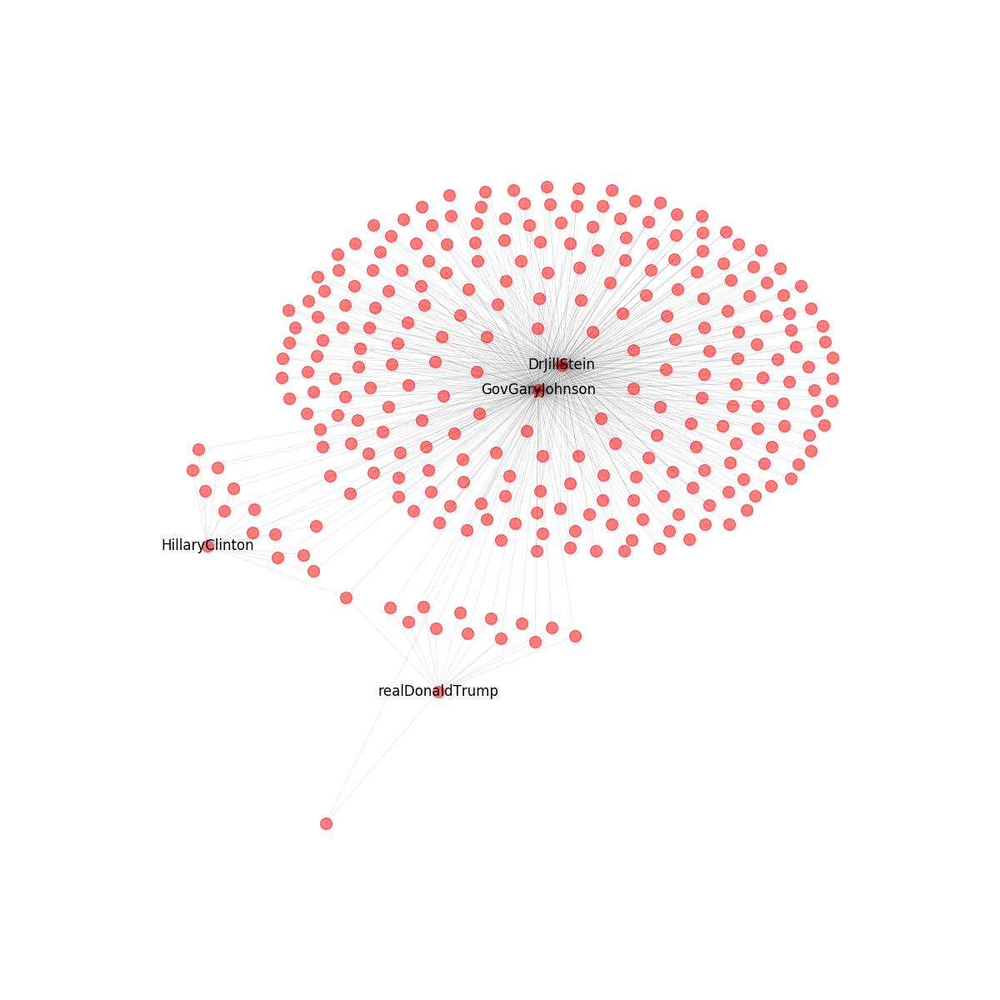

## Twitter API Initialization and graph analysis

This python script is an introduction to the Twitter API and network graph analysis.

Its main purpose is to collect data and make a graph analysis of a political social network.

We will analyse Twitter accounts of 4 U.S. presedential candidates from the previous election.

For getting started you used:

1. Create an account on [twitter.com](http://twitter.com).
2. Generate authentication tokens by following the instructions [here](https://developer.twitter.com/en/docs/basics/authentication/guides/access-tokens.html).
3. Add your tokens to the key/token variables in the python script.
4. Be sure you've installed the Python modules
[networkx](http://networkx.github.io/) and
[TwitterAPI](https://github.com/geduldig/TwitterAPI). Assuming you've already
installed [pip](http://pip.readthedocs.org/en/latest/installing.html), you can
do this with `pip install networkx TwitterAPI`.

We have also made some doctests to test the functionality of our functions.

__The candidates will be read from the candidates.txt file. You can change those candidates to any twitter accounts that you want.__

## Result

You can view in the following image the network resulted from the analysis:
